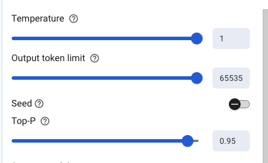

# AI keywords

```text
Temperature = Randomness | Factual <=> Creative, Hallucination
TopK = limits tokens by a fix number | Few choices <=> More choices
TopP = limits tokens by probability | Safe words <=> A large pool of words
RAG = SS (Semantic Search)
Token = English character, x, cat 1 token = 4 character
Zero-shot prompting
Few-shot prompting - With examples (pair of input output)
Structure output, System instruction
```

## My notes

| Task                   | Temperature | TopK | TopP |
| ---------------------- | ----------- | ---- | ---- |
| Analyze financial news | 0.2         | 40   | 0.95 |

## 🔹 Temperature, Top-K vs Top-P

| Parameter   | One-line purpose                      | Low                           | High                                                  |
| ----------- | ------------------------------------- | ----------------------------- | ----------------------------------------------------- |
| Temperature | Controls randomness                   | Predictable, factual          | 1.0 → hallucination                                   |
| TopK        | Limits how many tokens are considered | Very few choices              | More choices (fixed number)                           |
| TopP        | Limits tokens by probability mass     | Very safe, common tokens only | A larger pool of words, increasing variety (adaptive) |

**ultra-simple version**

| Parameter   | Low value       | High value                  |
| ----------- | --------------- | --------------------------- |
| Temperature | Randomness      | Random hallucination-prone  |
| TopK        | Few choices     | More choices (fixed number) |
| TopP        | Safe words only | Larger pool of words        |

- (one-liner) Temperature controls randomness, while Top-P / Top-K control token selection boundaries.

**Temperature**

- Controls randomness
- 0.0–0.3 → factual, deterministic
- 0.7–1.0 → creative
- > 1.0 → risky / hallucination-prone
- (one-liner) Temperature controls randomness, while Top-P / Top-K control token selection boundaries.

**Top-P (Nucleus Sampling)**

- Model selects tokens whose cumulative probability ≤ P
- Example: Top-P = 0.9
- More adaptive than Top-K
- Top-P (nucleus sampling) also controls randomness.
- Top-P (Nucleus Sampling) is the flexible, adaptive method
- (0.5 -> 0.95) The model considers a larger pool of words, increasing variety.

**Top-K**

- Model selects from the top K most likely tokens
- Example: TopK = 40
- Smaller K → more deterministic
- Larger K → more creative
- A fixed number.

**✅ Interview one-liner**

- Top-K limits the number of candidate tokens, while Top-P limits based on cumulative probability.

## Token

- Tokens can be single characters like z or whole words like cat.
- A token == 4 characters
- 100 tokens = 60-80 English words.
- Gemni API is billed the number of input and output tokens



- https://ai.google.dev/gemini-api/docs/tokens?lang=node
- https://www.skills.google/focuses/86502?catalog_rank=%7B%22rank%22%3A1%2C%22num_filters%22%3A0%2C%22has_search%22%3Atrue%7D&parent=catalog&search_id=67091914

| Task                   | Temperature | TopK | TopP |
| ---------------------- | ----------- | ---- | ---- |
| Analyze financial news | 0.2         | 40   | 0.95 |
| Code (generate SQL)    | 0.2         | 40   | 0.95 |
| Summarize              | 0.2         | 40   | 0.95 |
| Writing (Job post)     | 0.2         | 40   | 0.95 |

<hr />

## Prompt Engineering

- Prompt Layers
- I structure prompts using system instructions, role definition, task description, constraints, and examples.
- Zero-shot prompting : Direct prompts without examples
- Few-shot prompting : input-output pairs example
- Chain-of-Thought (CoT) : Let's think step by step, multi-step logic problems.
- Output formatting (JSON schemas)
- Guardrails / constraints

✅ CHAIN-OF-THOUGHT PROMPT:

```text
A farmer has 17 sheep. All but 9 die. How many are left?

Think through this step by step:
1. What does "all but 9" mean?
2. What happens to those 9?
3. How many are left?


Response: "Let me work through this:

1. 'All but 9' means everything except 9.
2. If all but 9 die, then 9 survive.
3. Therefore, 9 sheep are left alive.
```

**system instructions**

- Guide the behavior of Gemini models
- (Ex) You are a senior frontend engineer.
- (Ex) You are a chatbot that answers questions about an uploaded image.
- (Ex) You are a cat. Your name is Neko.

- https://docs.cloud.google.com/vertex-ai/generative-ai/docs/learn/prompts/adjust-parameter-values
- https://cloud.google.com/discover/what-is-prompt-engineering?hl=en

## 6️⃣ RAG (Retrieval-Augmented Generation)

- AI framework that enhances the output of Large Language Models (LLMs) by integrating an external f into the generation process.
- **Retrieval**: When a user submits a query, the system searches an external data source (often a vector database) for relevant snippets of information.
- **Augmentation**: The retrieved information is added to the user's original query as additional context, creating an "augmented" prompt.
- **Generation**: The LLM receives this enriched prompt and generates a response grounded in the provided facts, rather than relying solely on its internal memory

```text
User Query
 → Embed query
 → Vector DB search
 → Retrieved context
 → LLM response
```

**Why RAG?**

- Reduces hallucinations
- Uses private data
- Keeps model stateless

**Vector DB examples:**

- Pinecone

**Example**

- Mecial Decision Support: (Doctors getting instant answers from thousands of patient records)
- Financial Reporting
- E-commerce Personalization: (use RAG to integrate real-time inventory and purchasing trends. Instead of generic suggestions.)
