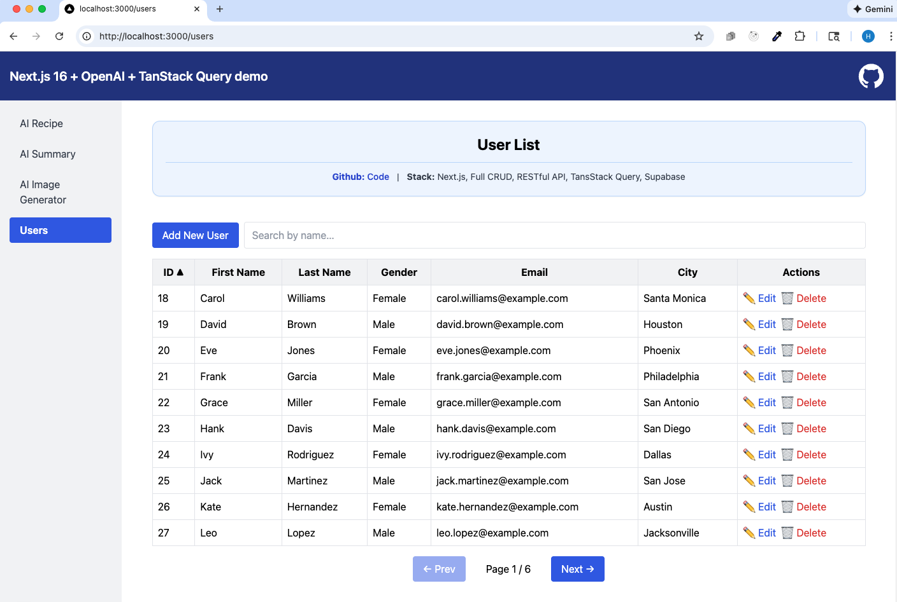
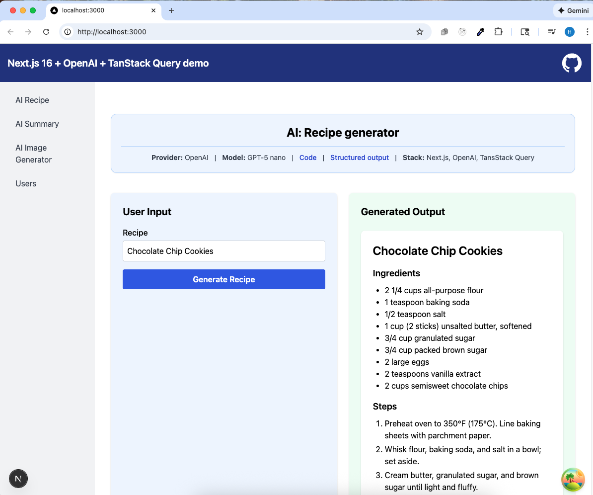
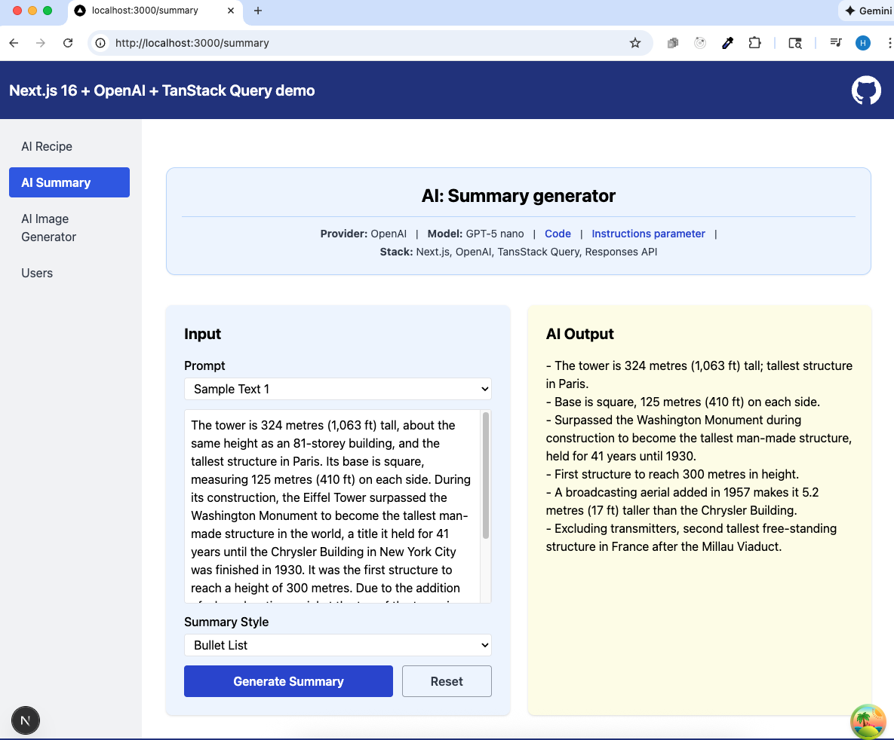
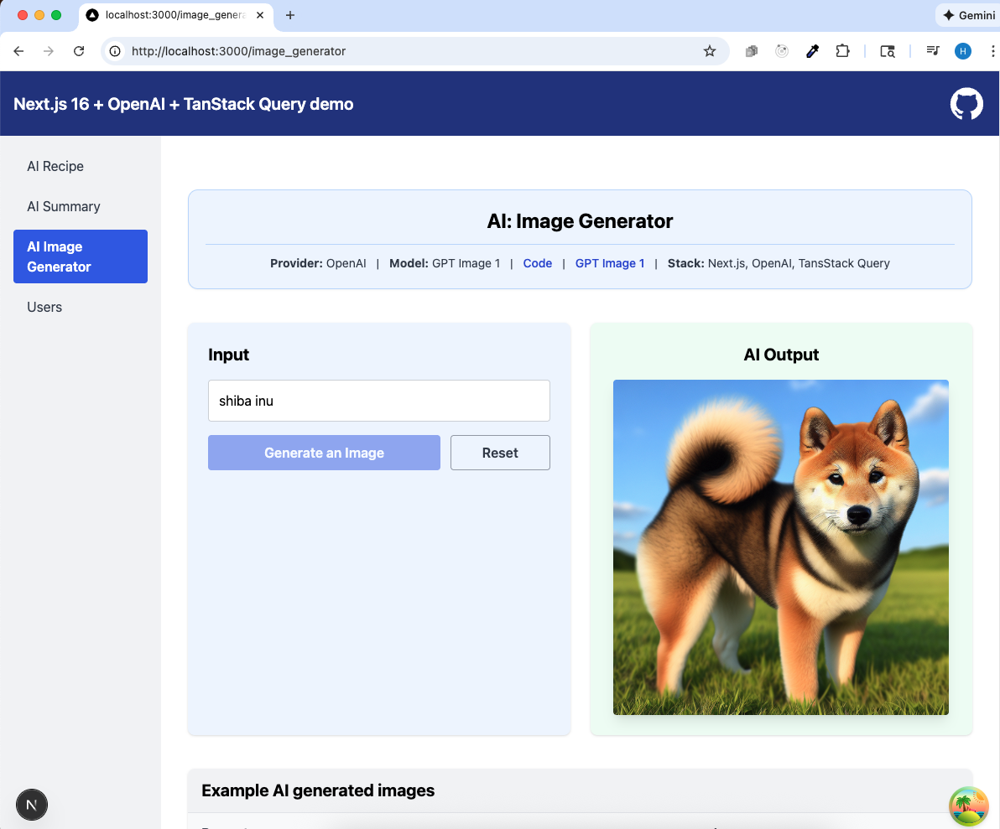

# Next.js + OpenAI + TanStack Query app

**Live URL:** https://next-openai-app-ruby.vercel.app/

## 🚀 Overview

A collection of small AI-driven applications built with Next.js 16, OpenAI GPT-5.0, and TanStack Query. This project demonstrates modern frontend practices, API routes, data fetching, server-side actions, and AI integration

## Tech Stack

- **Next.js 16**
- **OpenAI GPT-5.0 models**
- **TanStack Query v5**
- **Supabase database**
- **Vercel** (production deployment)
- **TypeScript**

## Applications Included

### Users App

- Full CRUD
- REST API using Next.js Route Handlers
- TanStack Query (fetching, caching, optimistic updates)



<hr />

### Recipe Generator

- AI-generated recipes using GPT-5.0
- Using Structured output
- TanStack Query for mutation handling.



<hr />

### Sumamry Generator

- Summarizes the text into one short paragraph (less than 300 characters). Three styles are available: **Short**, **Medium**, and **Bullet**.
- Uses TanStack Query for mutation handling



### Image Generator

- Using OpenAI cheapest AI model (DALL·E)
- TanStack Query for mutation handling.



<hr />

## Folder Structure

```css
src/
 ├── app/
 │    ├── api/
 │    │    ├── users/
 │    │    │    └── route.ts
 │    │    └── image_generator/
 │    │    │     └── route.ts
 │    │    └── recipe/
 │    │    │     └── route.ts
 │    │    └── summary/
 │    │         └── route.ts
 │    ├── recipe/
 │    │    └── page.tsx
 │    ├── summary/
 │    │    └── page.tsx
 │    ├── image_generator/
 │    │    └── page.tsx
 │    ├── users/
 │    │    └── page.tsx
 │    └── page.tsx  ← redirects to recipe
 │
 ├── components/
 │    ├── Header.tsx
 │    ├── Footer.tsx
 │    ├── LeftNav.tsx
 │    └── ExampleTable.tsx
 │
 ├── utils/
 │    └── formValidation.ts
 │
 ├── types/
 │    └── index.ts
 │
 └── lib/
      └── openai.ts
      └── supabaseClient.ts
```

### References:

- [Vercel -> Overview](https://vercel.com/hirokoymjs-projects)
- [Vercel -> Deployments](https://vercel.com/hirokoymjs-projects/~/deployments)
- [Supabase dashboard](https://supabase.com/dashboard/project/bksfkeopbvvuwwlleasu)
