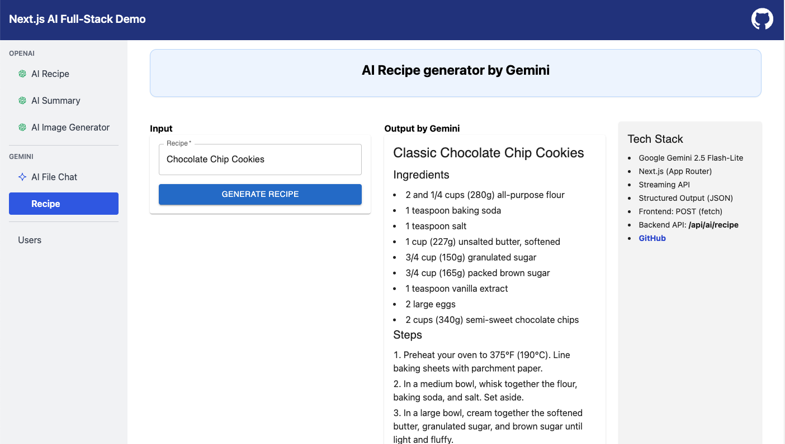

# AI Recipe generator (Gemini)

### Tech Stack

- **AI**: Google Gemini 2.5 Flash-Lite
- **Framework**: Next.js (App Router)
- **Frontend**: React, Fetch API (POST)
- **Backend**: Next.js Route Handler (`/api/ai/recipe`), Gemini SDK
- **AI Features**: Streaming responses, Structured JSON output

<hr />

### API: `/api/ai/recipe`

```js
POST /api/ai/recipe

Request:
{
  recipe: string
}

Response: // Gemini's output
{
  recipeName: string,
  ingredients: string[],
  steps: string[]
}
```

<hr />

### Notes

- Uses Gemini streaming with a JSON schema to ensure structured, type-safe output.
- Frontend progressively renders streamed recipe data.



<hr />

### Example Request

```js
POST http://localhost:3000/api/ai/recipe
Content-Type: application/json
```

**Payload**

```js
{
    "recipe": "Chocolate Chip Cookies"
}
```

**Response**

```js
{
    "recipeName": "Classic Chocolate Chip Cookies",
    "ingredients": [
        "2 1/4 cups all-purpose flour",
        "1 teaspoon baking soda",
        "1 teaspoon salt",
        "1 cup (2 sticks) unsalted butter, softened",
        "3/4 cup granulated sugar",
        "3/4 cup packed brown sugar",
        "1 teaspoon vanilla extract",
        "2 large eggs",
        "2 cups (12-ounce package) semisweet chocolate chips",
        "1 cup chopped nuts (optional)"
    ],
    "steps": [
        "Preheat oven to 375 degrees F (190 degrees C).",
        "In a small bowl, whisk together flour, baking soda, and salt. Set aside.",
        "In a large bowl, cream together the softened butter, granulated sugar, and brown sugar until light and fluffy.",
        "Beat in the vanilla extract and eggs one at a time until well combined.",
        "Gradually add the dry ingredients to the wet ingredients, mixing until just combined. Do not overmix.",
        "Stir in the chocolate chips and nuts (if using).",
        "Drop rounded tablespoons of dough onto ungreased baking sheets.",
        "Bake for 9 to 11 minutes, or until golden brown around the edges and still slightly soft in the center.",
        "Let cookies cool on the baking sheets for a few minutes before transferring them to wire racks to cool completely."
    ]
}
```

### Gemini Creation Code

**Prompt**

```js
const prompt = `
	Create a detailed cooking recipe for: "${recipe}"
	Return only JSON with:
	- recipeName
	- ingredients (array of strings)
	- steps (array of strings)
`;
```

**Frontend**

```js
const response = await fetch('/api/ai/recipe', {
  method: 'POST',
  headers: { 'Content-Type': 'application/json' },
  body: JSON.stringify({ recipe }),
});
//{...}
const recipe = recipeSchema.parse(JSON.parse(response.text));
```

**Backend**

```js
const response = await ai.models.generateContent({
  model: 'gemini-2.5-flash',
  contents: prompt,
  config: {
    responseMimeType: 'application/json',
    responseJsonSchema: zodToJsonSchema(recipeSchema),
  },
});

const recipe = recipeSchema.parse(JSON.parse(response.text));
console.log(recipe);
```

## Reference

- [Gemini API Structure Outputs](https://ai.google.dev/gemini-api/docs/structured-output?example=recipe)
- [Streaming](https://ai.google.dev/gemini-api/docs/structured-output?example=recipe#streaming)
