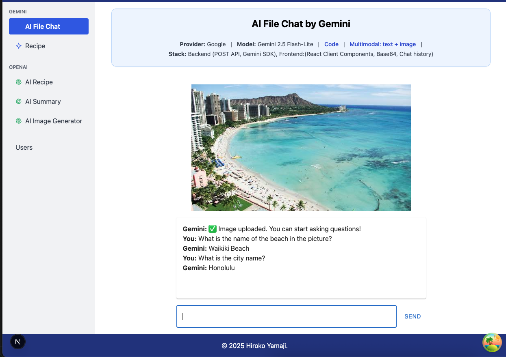

# AI File Chat by Gemini

### Tech Stack

- **AI**: Google Gemini 2.5 Flash-Lite
- **Framework**: Next.js (App Router)
- **Frontend**: React, Fetch API (POST), Base64 image upload
- **Backend**: Next.js Route Handler, Gemini SDK
- **AI feature**: Multi-turn conversation(chat): `ai.chats.create({...})`

<hr />

### API: `/api/file-chat`

```js
POST /api/file-chat

Request:
{
  message: string,		// User's question
  file?: { type: string, base64: string },
  history: ChatMessage[]
}

Response:
{
  text: string, // Gemini's latest reply
  updatedHistory: ChatMessage[]
}
```

### ChatMessage

```ts
type ChatMessage = {
  role: 'user' | 'model';
  parts: (
    | { text: string }
    | { inlineData: { mimeType: string; data: string } }
  )[];
};
```

### Notes

- The uploaded image is sent **once** at the beginning of the conversation.
- Subsequent requests rely on `history` to preserve context.
- inlineData.data must contain pure Base64 bytes (no data:image/... prefix).
- This endpoint supports **multimodal chat (text + image)** using Gemini chat sessions.

  

<hr />

### Code

- Frontend (UI): [page.ts](./page.tsx)
- Backend API (POST): [route.ts](../api/file-chat/route.ts)

<hr />

### Example Request

```js
POST /api/file-chat
Content-Type: application/json
```

```js
{
  "message": "What is the city name?",
  "file": {
    "type": "image/jpeg",
    "base64": "<BASE64_IMAGE_BYTES>"
  },
  "history": []
}
```

### Example Response

```js
{
  "text": "Honolulu.",
  "updatedHistory": [
    {
      "role": "user",
      "parts": [
        {
          "inlineData": {
            "mimeType": "image/jpeg",
            "data": "<BASE64_IMAGE_BYTES>"
          }
        }
      ]
    },
    {
      "role": "user",
      "parts": [
        { "text": "What is the city name?" }
      ]
    },
    {
      "role": "model",
      "parts": [
        { "text": "Honolulu." }
      ]
    }
  ]
}
```

<hr />

## Gemini API Docs

- [Multi-turn conversations (chat)](https://ai.google.dev/gemini-api/docs/text-generation#multi-turn-conversations)

  > Collect multiple rounds of prompts and responses into a chat.
