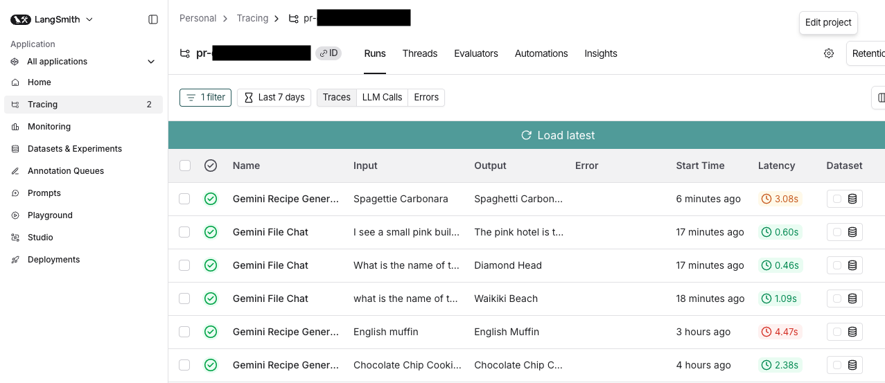

# File Chat by Gemini

### Tech Stack & Architectures

**Backend**

- **Next.js 16** (App Router)
- **Server Actions**: Leveraging `useActionState` for seamless Client-Server communication.
- **Gemini API (Gemini 2.5 Flash-Lite)**: Utilizing `chats.create` for session management and `chat.sendMessage` for multi-modal turns.
- **Zod**: Server-side form validation.
- **LangSmith**: Tracing and observability for AI runs.

**Frontend**

- **React useActionState**: Manages UI state, loading indicators, and server responses.
- **Custom Hook (`useBase64Image`)**: Handles client-side file validation (4MB limit), Base64 encoding, and memory management via `URL.revokeObjectURL`.
- **Material UI (MUI)**: UI components with responsive design.

---

### Project Structure

```js

src/app/file-chat/
├── actions.ts 			# Server Actions: Gemini SDK logic & Chat history management
├── Chat.tsx 			# Client Component: The main chat interface & message rendering
├── FileUpload.tsx 		# Client Component: Upload a file
├── page.tsx 			# Server Component: Feature entry point
└── useBase64Image.ts   # Custom Hook: Base64 conversion & memory cleanup
```

### The Input (Payload)

- **Message**: The user's text prompt.
- **History**: The previous messages.
- **Image**: The uploaded image by a user. The Base64 data (only included on the first message to save bandwidth).

```js
const [state, formAction, isPending] = useActionState<ChatState, FormData>(submitPrompt);
```

### The Output (Response State)

The Server Action returns a ChatState object that React uses to update the UI:

- **success**: Boolean toggle to reset the form or show errors.
- **text**: The latest string response from Gemini.
- **updatedHistory**: The new conversation array (including the AI's response).
- **error**: A string message if something goes wrong (e.g., "API Key missing").

```js
type ChatState = {
  success: boolean;
  text?: string;
  updatedHistory: any[];
  error?: string;
};
```

### Screenshot




### References

- [Gemini API: Multi-turn conversations](https://ai.google.dev/gemini-api/docs/text-generation#multi-turn-conversations)
- [@google/genai: sendMessage](https://googleapis.github.io/js-genai/release_docs/classes/chats.Chat.html#sendmessage)
- [@google/genai: Chat Creation](https://googleapis.github.io/js-genai/release_docs/classes/chats.Chats.html#create)

