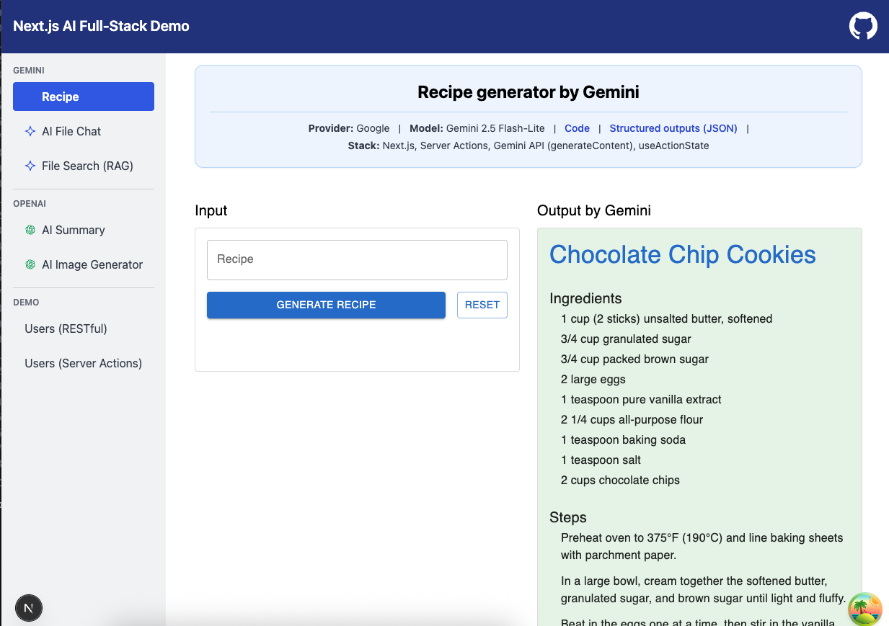
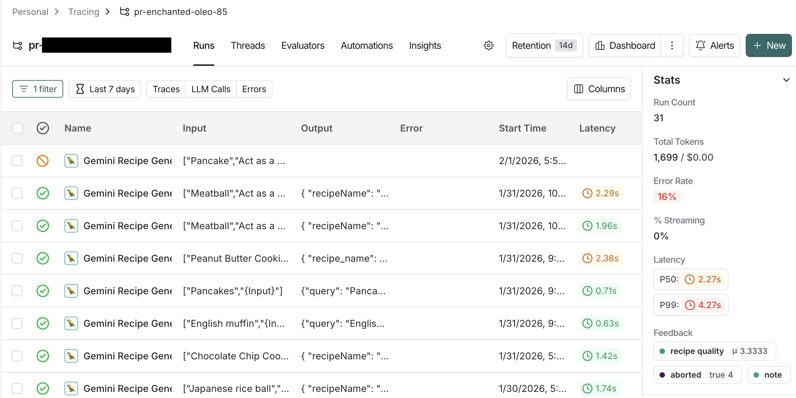

# AI Recipe generator (Gemini)

**Backend**

- **Next.js 16 (App Router)**
- **Gemini API (Gemini 2.0 Flash-Lite):** `generateContent`.
- **Structured Outputs:** Leveraging `responseMimeType: 'application/json'` to ensure consistent data parsing.
- **Zod:** Defining the AI's response shape via JSON Schema.
- **LangSmith**: Tracing and observability for AI runs.

**Frontend**

- **React `useActionState` Hook:** Managing form state, pending transitions, and server responses.
- **Material UI (MUI)**: UI components and layout.

---

### Folder Structure

```js
app/
  └── recipe/
      ├── actions.ts    # Server-side logic (Gemini API)
      ├── page.tsx      # Client-side UI (form handling)
      └── README.md
```

---

### Input (Payload)

The application uses a `FormData` object submitted via a Next.js Server Action.

- **recipe**: The name of the dish to generate.

### Output (Response State)

The state is managed by the `useActionState` hook and follows this structure:

- **success** (boolean): Indicates if the recipe was generated successfully.
- **data** (object): Contains recipeName, ingredients, and steps.
- **message** (string): (Optional) Error message or status update.

```js
type Recipe = {
  recipeName: string;
  ingredients: string[];
  steps: string[];
};

export type RecipeState =
  | { success: true; data: Recipe; message?: string }
  | { success: false; message: string; data?: Recipe }
  | null;
```

### Gemini API usage

```ts
const response = await ai.models.generateContent({
  model: 'gemini-2.0-flash-lite',
  contents: prompt,
  config: {
    responseMimeType: 'application/json',
    responseJsonSchema: zodToJsonSchema(recipeSchema as any),
  },
});
```

### screenshot



### LangSmith:

**How to Version the Prompt from Traces**

1. LangSmith -> Project -> Tracing -> Open a successful Run.
2. Click **Playground** (this imports the exact prompt and model settings used).
3. Note on Structured Output: Instead of using the "Output Schema" UI toggle, ensure the JSON requirements are written in the **SYSTEM** message. This ensures the schema persists when saved to the Gallery.
4. Click Save as... -> `recipe-generator`.



### Reference

- [Gemini API Structured Outputs](https://ai.google.dev/gemini-api/docs/structured-output?example=recipe)
- [Next.js Server Actions Documentation](https://nextjs.org/docs/app/building-your-application/data-fetching/server-actions-and-mutations)
- [@google/genai: generateContent](https://googleapis.github.io/js-genai/release_docs/classes/models.Models.html#generatecontent)
